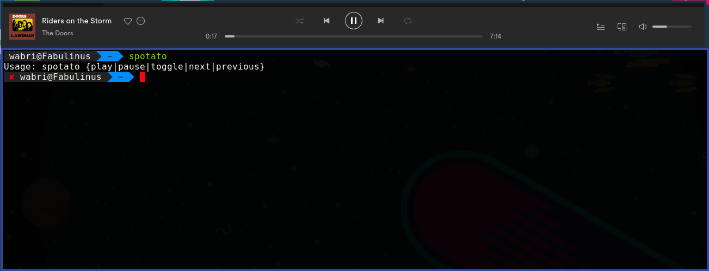
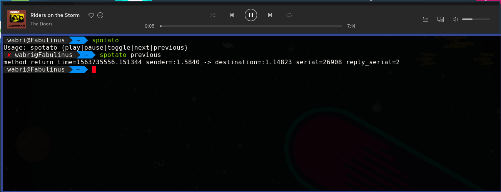
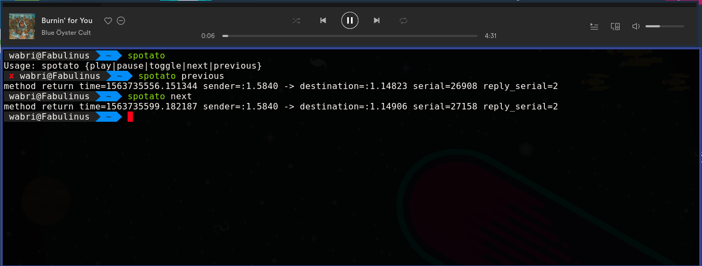
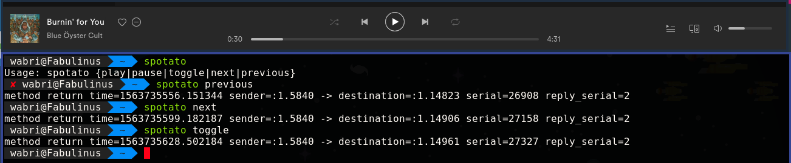
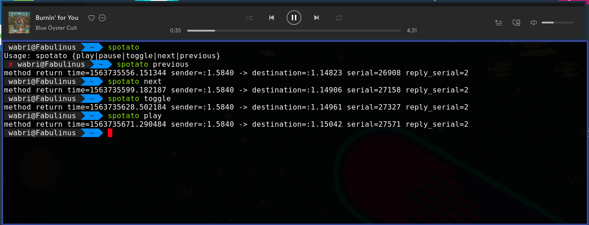
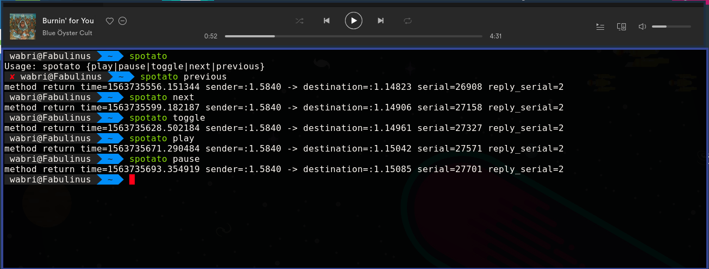

<hl align=center>


# Spotato


***The name of this repository was recommended by github***

With this potato you can controll your mediaplayer client with the command line.
This feature is already implemented in all the desktop environment, but not for
all.

**NOT ONLY SPOTIFY CAN BE CONTROLL**

Works with:
- Spotify
- Headset
- Chromium browser and derivate like Brave

## Usage

<hl align=center>


There are 1+5 commands for spotato:

* **help**: this is not a real command, this is the return if not matches the
	other commands

	Without any arguments the spotato shows what power have.

* **previous**

	This command works as rewinder of the song or if the actual song is in the
	first seconds (based on Spotify rules) reproduce the previous song.

* **next**

	This tell the potato to go to the next song.

* **toggle**

	The most common command that everyone use most, if play than pause and if
	pause play.

* **play**

	It works only if the song is not played (pause).

* **pause**

	It works only if the song is in paused (play).

It is very simple, if you want to skip song then run `spotato next` or if you
want to pause the song just run `spotato pause` or even `spotato toggle`. Same
thing if you want to listen again the previous song run `spotato previous`, or
if the song is in pause and you want to play that the send the spotato command
`spotato play`.

There is another command to change the default mediaplayer:

```Bash
spotato mediaplayer
```

That's all, nothing more. Nice and easy.

## Install

Took only 3 steps:

1. Clone the repos:

	```Bash
	git clone https://github.com/Wabri/Spotato.git
	```

2. Move into the Potato directory:

	```Bash
	cd spotato
	```

3. Run with superuser permissions:

	```Bash
	./install.sh
	```

Now you can use the power of the potato music to do what you want.

## Helps and more

### Install Spotify client

Obviously this works if you have the spotify client on the machine. You can
install it with several ways:

* [Help page of the official site](https://www.spotify.com/it/download/linux/)
* [Snapcraft by canonical](https://snapcraft.io/spotify)
* (Only for debian distros) Adding the repository:
    ```Bash
	# 1. Add the Spotify repository signing keys to be able to verify downloaded packages
	curl -sS https://download.spotify.com/debian/pubkey.gpg | sudo apt-key add -

	# 2. Add the Spotify repository
	echo "deb http://repository.spotify.com stable non-free" | sudo tee /etc/apt/sources.list.d/spotify.list

	# 3. Update list of available packages
	sudo apt-get update

	# 4. Install Spotify
	sudo apt-get install spotify-client
	```

### I3wm users

As you imagine I create this script to use spotify with [my i3wm configuration](https://github.com/Wabri/dotfiles).

**Some advices**:

1. Some keyboard have the special function keys to controll the media player
(I do not), to use spotato with this keys you need to add something like this
into your i3wm configuration file:

	```I3wm
	# Audio control
	bindsym XF86AudioPrev exec spotato previous
	bindsym XF86AudioNext exec spotato next
	bindsym XF86AudioPlay exec spotato toggle
	```

2. Or you can simple create a i3wm mode if you don't have that special keys
(like me), something like this:

	```I3wm
	# Spotify modality
	set $mode_spotato (h)Previous, (l)Next, (j)Pause, (k)Play, (s)Toggle
	mode "$mode_spotify" {
	    bindsym k exec spotato play
	    bindsym j exec spotato pause
	    bindsym s exec spotato toggle, mode "default"
	    bindsym l exec spotato next
	    bindsym h exec spotato previous

	    # back to normal
	    bindsym q mode "default"
	    bindsym Escape mode "default"
	}
	bindsym $mod+s mode "$mode_spotato"
	```

## How to contribute

If you have some **advices** just create a new issue.
If you want to add some more feature **fork** this repository and pull request if
you want to help me (or other).

## Contributors

Developer: [Wabri](https://github.com/wabri)

Creator of logo: [Munadikieh](https://github.com/munadikieh)
